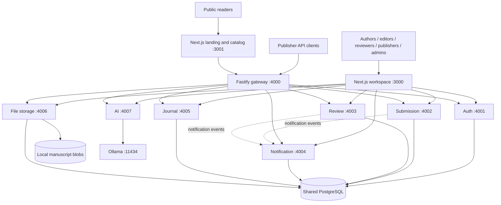
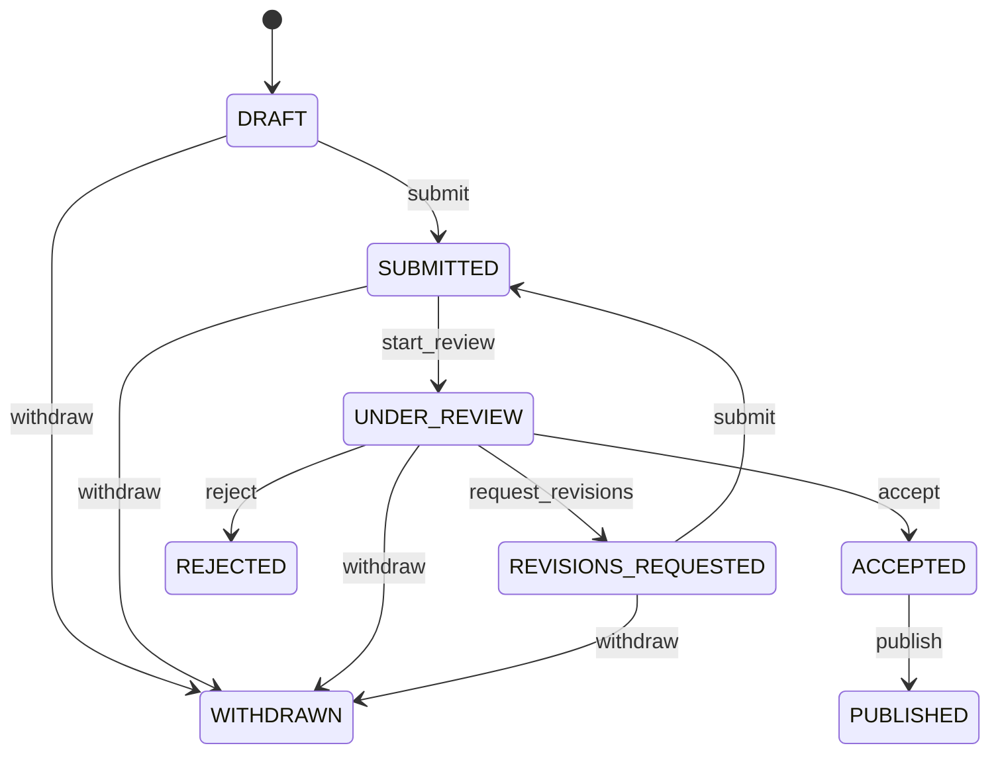
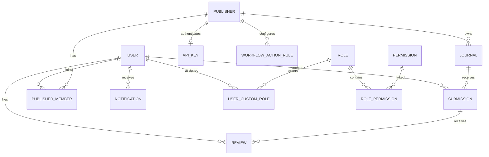

# Research OS — Project Workflow Analysis

Date: 2026-09-24  
Repository: `research-publishing-os`  
Baseline: `2007008` — Add AI Executive Dashboard on the admin page

## 1. Scope and assessment

Research OS is a research publishing platform implemented as a pnpm/Turborepo monorepo. Its working application slice is journal publishing: account and publisher setup, manuscript submission, reviewer assignment, editorial decisions, publication metadata, and public discovery. Administration, publisher API keys, notifications, configurable action roles, and local AI assistance support that slice.

The repository also reserves directories for conferences, books, production, DOI registration, payments, analytics, and specialized AI modules. Directory presence does not establish an implemented workflow. Most of these areas contain only scaffold README files; conference and book database models exist without corresponding implemented service flows.

This analysis follows source code, route handlers, Prisma models, frontend actions, and existing test structure. It is a static assessment, not a live deployment audit: the app, database migrations, and test suite were not run for this documentation task. Findings below are code observations and their implications, not runtime reproductions.

## 2. Architecture and request flow

Ports shown are defaults. Backend entry points call `findFreePort()` and may bind elsewhere; upstream URLs must still match the actual listeners. No automatic propagation of fallback ports was found.

| Component | Current responsibility |
| --- | --- |
| `apps/web` | Authenticated workspace, server actions, manuscript and review screens, publisher portal, admin dashboard |
| `apps/landing` | Public journal/article discovery through the gateway |
| `services/api-gateway` | `/api/*` proxying to `/v1/*`, CORS, rate limits, aggregate health |
| `services/auth` | Registration, login, JWTs, base roles, custom roles and permissions |
| `services/journal` | Publishers, journals, ownership, team membership, API keys, workflow role overrides |
| `services/submission` | Submission records, manuscript attachment, transitions, publication metadata |
| `services/review` | Assignment and one-time review submission |
| `services/notification` | Stored notifications, read state, delivery status and templates |
| `services/file-storage` | Upload metadata, local blobs, authenticated download |
| `services/ai` | Keyword suggestions, abstract revision, executive summaries and contextual Q&A |

The workspace acts as a backend-for-frontend: it reads an HTTP-only session cookie and calls internal services server-side. It generally bypasses the gateway. The public landing app and external clients use the gateway. Consequently, gateway rate limits do not cover direct service calls from the workspace.

Services share one PostgreSQL database through Prisma and perform cross-domain reads for authorization and relationships. These are separately running services, not isolated data stores. Redis is defined in Docker Compose, but no Redis use was found in the inspected service/package source.

Sources: [gateway](../services/api-gateway/src/app.ts), [web API helper](../apps/web/lib/api.ts), [landing API helper](../apps/landing/lib/api.ts), [database schema](../packages/database/prisma/schema.prisma).

## 3. Identity, roles, and publisher onboarding

1. A visitor registers with name, email, and password. Registration always creates an `AUTHOR`; it does not accept privileged role selection.
2. Login checks a bcrypt password hash and issues a JWT containing user ID, email, roles, and custom permissions. Token lifetime defaults to one hour. The web session cookie also lasts one hour.
3. Login sends admins/editors to `/dashboard`, publishers to `/publisher`, reviewers to `/reviews`, and other users to `/dashboard`.
4. A superadmin can provision admin accounts. Privileged auth routes manage base roles and additive custom roles.
5. A publisher creates an organization and becomes its owner. Admin-created publisher records are initially unowned.
6. Journals belong to publishers. Publisher owners/admins manage teams and publisher configuration.
7. Team onboarding requires an existing user who already holds the corresponding global `EDITOR` or `REVIEWER` role. Publisher membership scopes that capability to a tenant; it does not itself grant the base role.

| Role | Principal workflow |
| --- | --- |
| AUTHOR | Create own drafts, attach manuscripts, submit/re-submit, withdraw eligible submissions |
| REVIEWER | Read assigned work and file a recommendation |
| EDITOR | Access member publishers' submissions, assign reviewers, take editorial actions |
| PUBLISHER | Manage owned publisher organizations and journals; publish accepted work by default |
| ADMIN | Platform management and broad resource access |
| SUPERADMIN | Admin provisioning and platform access, subject to the transition inconsistency below |
| READER | Defined base role; public catalog access does not require login |

Authorization combines base roles, publisher ownership, team membership, assignments, and custom permissions. Some custom grants, such as `submissions.editorial` and `reviews.assign`, deliberately allow global access rather than tenant-specific access. They should not be described as tenant-scoped permissions.

Sources: [auth routes](../services/auth/src/app.ts), [login actions](../apps/web/lib/auth-actions.ts), [journal routes](../services/journal/src/app.ts).

## 4. Manuscript lifecycle

| Action | Allowed starting states | Result | Default roles |
| --- | --- | --- | --- |
| `submit` | DRAFT, REVISIONS_REQUESTED | SUBMITTED | AUTHOR, ADMIN |
| `start_review` | SUBMITTED | UNDER_REVIEW | EDITOR, ADMIN |
| `request_revisions` | UNDER_REVIEW | REVISIONS_REQUESTED | EDITOR, ADMIN |
| `accept` | UNDER_REVIEW | ACCEPTED | EDITOR, ADMIN |
| `reject` | UNDER_REVIEW | REJECTED | EDITOR, ADMIN |
| `publish` | ACCEPTED | PUBLISHED | PUBLISHER, EDITOR, ADMIN |
| `withdraw` | DRAFT, SUBMITTED, UNDER_REVIEW, REVISIONS_REQUESTED | WITHDRAWN | AUTHOR, EDITOR, ADMIN |

These are the literal engine defaults; resource access is checked separately. A publisher can override the role list per action. Overrides replace the default list and add ADMIN/SUPERADMIN back in. The state graph itself remains fixed. Rejected, withdrawn, and published records have no outgoing transition.

### Author journey

1. Open `/submissions/new`, choose a journal, and enter title, abstract, and keywords.
2. Optionally request AI keyword suggestions or an abstract rewrite.
3. Create a DRAFT submission.
4. Upload a PDF, Word document, or plain text file, with a default 20 MB limit. The web action first uploads the blob, then attaches its returned URL to the submission.
5. Submit using the submission action endpoint. It sets `submittedAt` and notifies platform admins and the journal publisher's editor members.
6. If revisions are requested, replace the manuscript while the record is editable and submit again.

Manuscript attachment is restricted to the author in DRAFT or REVISIONS_REQUESTED. The inspected service has no general title/abstract/keyword update endpoint. Submission does not require an attached manuscript. Re-submission overwrites `submittedAt`; there is no revision-round model or full version history.

### Editorial and reviewer journey

1. An authorized editor/admin opens a submission and assigns a reviewer while it is SUBMITTED or UNDER_REVIEW.
2. Normal editor assignments require reviewer membership in that publisher. Admins bypass that eligibility check. Duplicate submission/reviewer pairs are rejected.
3. Assignment sends a reviewer notification; it does not automatically start review.
4. The editor performs `start_review` separately.
5. The assigned reviewer files comments and one recommendation: ACCEPT, MINOR_REVISION, MAJOR_REVISION, or REJECT.
6. Filing records `submittedAt`, notifies admins and tenant editors, and does not change manuscript status.
7. The editor explicitly requests revisions, accepts, or rejects.

Reviews can be filed once. The review submission handler does not check the manuscript's current status. Editorial decisions do not enforce a minimum number of completed reviews. Since a reviewer cannot be assigned twice to the same submission and cannot re-file an existing review, subsequent revision rounds have no complete review-cycle implementation.

### Publication and public discovery

Publishing transitions ACCEPTED to PUBLISHED. If no DOI exists, the handler generates a local DOI string and sets `publishedAt`; it then notifies the author. The default prefix is `10.5555`. This is identifier generation, not an external DOI registration/deposit workflow.

The landing app fetches published submissions and public journals through the gateway. Article discovery is implemented as metadata pages; the file service still requires authentication. There is no implemented anonymous manuscript download flow in the inspected routes.

Sources: [workflow engine](../packages/workflow-engine/src/index.ts), [submission routes](../services/submission/src/app.ts), [review routes](../services/review/src/app.ts), [upload action](../apps/web/lib/file-actions.ts), [submission screen](../apps/web/app/submissions/[id]/page.tsx), [DOI utility](../packages/utils/src/index.ts).

## 5. Supporting workflows

### Publisher integration

Each publisher can have one API key, with create, inspect, rotate, enable/disable, and delete operations. An enabled key authenticates the organization using `x-api-key`. It can list its journals/submissions and publish its accepted manuscripts. API-key publishing consults the same tenant publish-role override as the JWT path. Keys are stored as plaintext values in the current Prisma schema.

### Notifications

Submission decisions notify authors; submissions and filed reviews notify admins and relevant publisher editors; assignments notify reviewers; acceptance notifies the publisher owner. Emitters use best-effort HTTP calls to an internal endpoint protected by `x-internal-secret`. The gateway strips that header and does not expose notification creation.

The notification service persists messages and marks delivery SENT or FAILED. Its current entry point uses `ConsoleMailer`, so SENT does not establish delivery to a real email inbox. Users have a feed and individual/all-read actions. No durable event queue, retry worker, or transactional outbox was found in this flow.

### AI and executive dashboard

AI uses configurable Ollama, defaulting to `http://localhost:11434` and model `qwen`. Keyword/abstract routes require authentication; executive summary/Q&A routes require ADMIN or SUPERADMIN. Summaries use supplied statistics, and Q&A uses supplied context rather than a live database agent or implemented RAG pipeline. These routes do not themselves execute workflow transitions.

The admin dashboard aggregates users, journals, publishers, submissions, reviews, notification counts, and service health. It computes acceptance rate, review turnaround, 12-week creation trends, and keyword frequency. Alerts flag overdue reviews, submissions pending over five days, accepted work awaiting publication, offline services, and failed notifications. These are deterministic calculations; AI adds narrative assistance. Some failed upstream responses fall back to empty data or zero counts, which can make unavailable data look like genuine zero activity.

Sources: [notification routes](../services/notification/src/app.ts), [notification entry point](../services/notification/src/index.ts), [AI routes](../services/ai/src/app.ts), [Ollama client](../services/ai/src/ollama-client.ts), [dashboard calculations](../apps/web/lib/executive-stats.ts), [admin page](../apps/web/app/dashboard/admin/page.tsx).

## 6. Data relationships

`FileObject` stores an owner ID and blob path. Submission attachment is a string `manuscriptUrl`, not a Prisma file relation. The schema has no dedicated workflow event log, decision record, manuscript version, review round, production task, or DOI deposit record.

## 7. Gaps and recommended follow-up order

These findings should be verified with targeted regression tests before implementation changes.

| Priority | Observed behavior and impact | Follow-up |
| --- | --- | --- |
| High | File downloads grant every EDITOR access by global role, whereas submission access checks publisher membership. A known file ID can cross the intended tenant boundary. Publishers are also absent from file-access grants unless otherwise eligible. | Apply consistent submission/tenant authorization to downloads. Source: `services/file-storage/src/app.ts`. |
| High | SUPERADMIN is recognized by resource access helpers but absent from default transition roles. The engine only adds it when an override is present. A SUPERADMIN-only account can pass access checks and then fail a default action. | Normalize platform bypass across transitions and creation routes; test SUPERADMIN-only accounts. Sources: workflow engine and submission routes. |
| High | Detail `allowedActions` uses base roles, but execution adds an effective EDITOR for `submissions.editorial`. List routes and frontend staff panels also omit some custom-permission paths. | Use one effective authorization policy for lists, details, UI actions, and writes. Sources: submission/review routes and submission screen. |
| High | Manuscript attachment accepts an arbitrary nonempty string without checking file existence or ownership. Upload and attachment are separate operations. | Validate a typed file relationship and clean up failed/orphan uploads. Sources: submission routes, upload action, Prisma schema. |
| Medium | Reviews have no revision rounds, re-filing, decision quorum, or current-state gate when filed. Authors do not receive the staff review panel containing comments. | Define the revision/feedback contract and add round-aware reviews and author-visible decision feedback. |
| Medium | Transitions read a status then update by ID without a status/version condition. Concurrent decisions may overwrite one another. | Add optimistic concurrency or transactional conditional updates. Source: submission Prisma store. |
| Medium | JWT roles/permissions remain the login snapshot; `/auth/me` reads fresh values. Revoked grants can remain in an existing token until expiry. | Define revocation/session refresh behavior and make UI/API expectations consistent. |
| Medium | Local DOI generation is not registration; `publishedAt` is set only when DOI is absent. Existing DOI records can publish without a new publication timestamp. | Separate publication timestamping from DOI creation and implement deposits if required. |
| Medium | Notifications have no durable handoff/retries and use console delivery. | Configure real delivery and durable event handling before relying on email workflows. |
| Medium | API keys are stored directly; backend fallback ports are not propagated to callers. | Hash keys and establish stable/discovered service addresses. |
| Medium | Public published-list route returns full stored submission rows, beyond the narrower frontend DTO. | Define an explicit public response projection. Source: submission routes and Prisma store. |
| Medium | Admin metrics may represent unavailable data as zero. | Preserve partial-data/error state in metrics and AI context. |

## 8. Development, verification, and implementation boundary

The repository declares Node >=20 and pnpm 9.15.4; CI selects Node 22. Root commands are `pnpm dev`, `pnpm build`, `pnpm test`, `pnpm lint`, and `pnpm typecheck`. Database generation/migrations are managed by `@rpos/database`. Docker Compose defines PostgreSQL on host port 5433 and Redis on 6379. It does not start the application services or Ollama.

Service `buildApp` factories support dependency injection with in-memory stores. Existing Vitest suites cover auth, journal, submission, review, notifications, files, gateway, AI, workflow transitions, and port utilities. That test structure does not by itself validate Prisma behavior or the full browser journey. No browser end-to-end test files were found in the inspected repository paths.

The active CI workflow installs dependencies, builds, and runs tests. Separate lint/test/CD workflow files and scripts under `scripts/` are empty scaffolds. The shared config helper parses supplied environment variables; it does not load a root `.env` itself. Startup configuration and dependency build order should be checked before treating `pnpm dev` as a complete bootstrap procedure.

Recommended sequence:

1. Resolve authorization inconsistencies and cover cross-tenant/file/custom-role cases.
2. Complete manuscript versioning, reviewer revision rounds, and author feedback.
3. Add transition concurrency control and a persistent decision/event history.
4. Harden publication metadata, notifications, public DTOs, and API-key handling.
5. Verify one complete browser journey against PostgreSQL: publisher setup → author draft/upload → submission → reviewer assignment → revisions → acceptance → publication → public discovery.
6. Expand conference, book, production, payment, and specialized AI workflows after the journal lifecycle is reliable.

Existing [architecture overview](architecture/overview.md) is useful background but predates parts of the current implementation, including AI, SUPERADMIN, custom permissions, and tenant workflow overrides. This document describes the reviewed code baseline and should be updated as those behaviors change.
