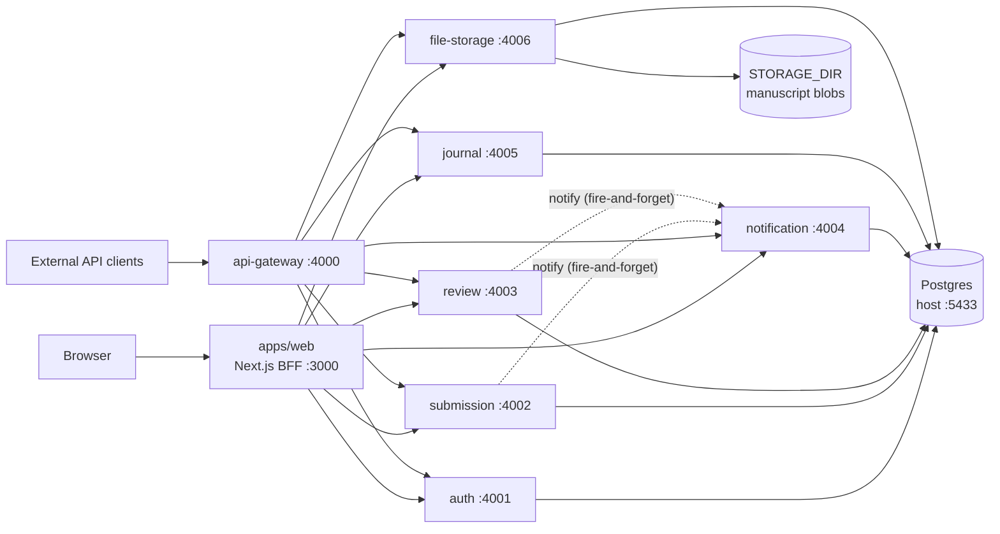
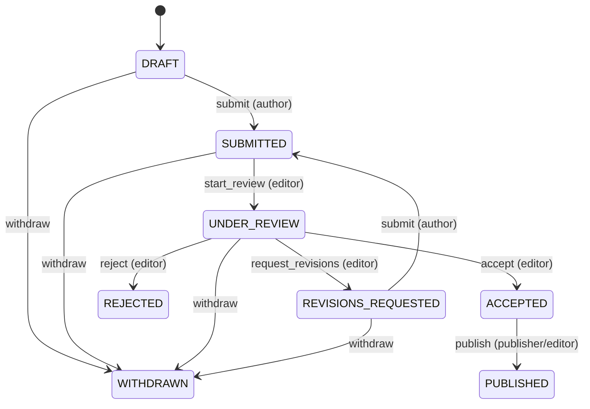

# Architecture Overview

RPOS is a pnpm + Turborepo monorepo: Fastify microservices over one Postgres
database, a Next.js web app as a backend-for-frontend, and an API gateway as the
single public entry point.

## System map



All ports are *preferences*: every service resolves its actual port with
`findFreePort()` from `@rpos/utils` and falls back to the next free one,
logging the rebind. Never hardcode a port.

## Services

| Service        | Port | Owns                                                            |
| -------------- | ---- | --------------------------------------------------------------- |
| api-gateway    | 4000 | Public routing, rate limiting, CORS, upstream health aggregate  |
| auth           | 4001 | Users, registration, login, JWT issuance, role-scoped user list |
| submission     | 4002 | Manuscripts, workflow actions, manuscript attachment            |
| review         | 4003 | Reviewer assignment, recommendations                            |
| notification   | 4004 | Notification persistence, templating, email delivery            |
| journal        | 4005 | Publishers and journals catalog                                 |
| file-storage   | 4006 | Blob upload/download with metadata and access control           |

## Service anatomy

Every service follows the same shape; copy it for new services (see
[adding-a-service.md](adding-a-service.md)):

```
services/<name>/src/
  app.ts          buildApp(options) — pure factory, no process.env access
  store.ts        Store interface + InMemory implementation (used by tests)
  prisma-store.ts Prisma implementation of the same interface (used in prod)
  index.ts        composition root: loadEnv -> stores -> findFreePort -> listen
services/<name>/test/<name>.test.ts   vitest against buildApp + in-memory store
```

`buildApp` receives everything it needs (store, secrets, collaborators such as
a `Mailer` or `Notifier`) so tests construct the whole HTTP app with in-memory
dependencies and drive it via `app.inject()` — no network, no database.

## Authentication and authorization

- The **auth service** signs HS256 JWTs (`sub`, `email`, `roles`) with the
  shared `JWT_SECRET`; every other service verifies the same secret via
  `@fastify/jwt`. There is no session state in the services.
- **Roles** (`ADMIN, PUBLISHER, EDITOR, REVIEWER, AUTHOR, READER`) travel in
  the token; route handlers check them explicitly.
- **Existence hiding:** when a caller lacks access to a resource they don't
  own, services return **404, not 403**, so the API never confirms a resource
  exists. 403 is reserved for "you can see it but may not do that" (e.g. an
  editor viewing but not filing someone else's review).
- The **web app** stores the JWT in an httpOnly cookie and talks to services
  exclusively from the server (server actions / route handlers), so no token
  or internal URL reaches browser JavaScript.

## Service-to-service calls

Internal endpoints (currently only `POST /v1/notifications`) are guarded by an
`x-internal-secret` header (`INTERNAL_API_SECRET`). Two safeguards:

1. The **gateway strips** `x-internal-secret` from all inbound requests and
   does not route the internal endpoint at all.
2. Emitters use `HttpNotifier` from `@rpos/shared` — **fire-and-forget and
   never throws**, so a down notification service cannot fail a user request.

## Data

One Postgres database; the Prisma schema lives in
`packages/database/prisma/schema.prisma` (inside the package so the Prisma CLI
can resolve its tooling). Each service logically owns its tables:

| Table         | Owner        | Cross-service reads (pragmatic, documented)            |
| ------------- | ------------ | ------------------------------------------------------ |
| users         | auth         | notification resolves recipient email/name             |
| submissions   | submission   | review reads id/status/title to validate assignment    |
| reviews       | review       | submission checks reviewer assignment for read access  |
| journals, publishers | journal | —                                                 |
| notifications | notification | —                                                      |
| files         | file-storage | —                                                      |

Migrations: `pnpm --filter @rpos/database migrate:dev`.

## Submission workflow

The state machine lives in `@rpos/workflow-engine` as a declarative transition
table (action → allowed from-states → resulting state → allowed roles).
Services and the web UI both consult it: the API returns `allowedActions` with
each submission, and the UI renders exactly those buttons.



Editorial decisions notify the author; assignments notify the reviewer
(rendered and delivered by the notification service).

## Shared packages

| Package                | Contents                                                     |
| ---------------------- | ------------------------------------------------------------ |
| `@rpos/types`          | Role/status/recommendation constants and shared interfaces   |
| `@rpos/validation`     | Zod schemas used by services **and** web forms (one source)  |
| `@rpos/config`         | `loadEnv(schema)` — fail-fast env parsing                    |
| `@rpos/logger`         | Pino factory                                                 |
| `@rpos/database`       | Prisma schema, migrations, client singleton                  |
| `@rpos/workflow-engine`| Submission state machine                                     |
| `@rpos/email`          | `Mailer` interface + `ConsoleMailer` (SMTP impl drops in)    |
| `@rpos/shared`         | `Notifier` (HTTP fire-and-forget) for service-to-service     |
| `@rpos/utils`          | `findFreePort`, `slugify`                                    |

## Web app

`apps/web` is the reference implementation of the mandated frontend stack —
Next.js 15 + React 19, Tailwind CSS v4, shadcn/ui on Radix, Lucide icons,
React Hook Form + Zod, TanStack Table/Query. See `apps/web/README.md` for the
full stack table and conventions. File downloads proxy through
`app/files/[id]/route.ts` so the session cookie is exchanged for a bearer
token server-side.

## Testing

`pnpm test` runs vitest suites per package through Turbo. Services are tested
via `buildApp` + in-memory stores + `app.inject()`; the gateway is tested
against real stub upstreams on ephemeral ports. No test touches Postgres.
